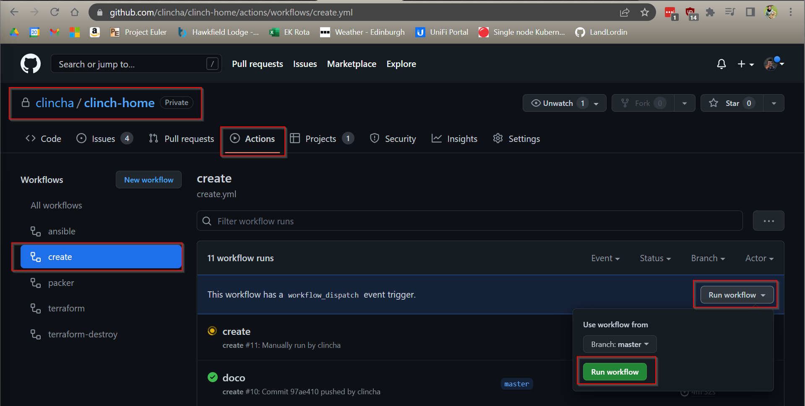
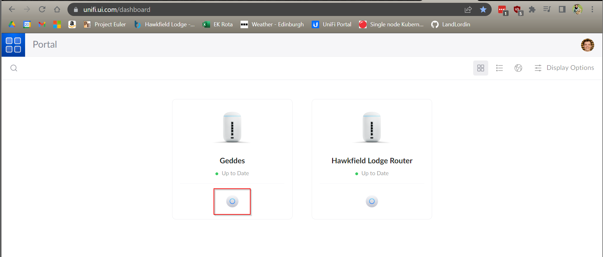

# Deployment

This is the end-to-end process for deploying out the clinch-home cloud.

## Packer template

[//]: # (TODO)

- Local network access to the server
- Running the packer template when you can connect to the Proxmox server directly
- Setting up the template

## Creating the virtual infrastructure

Run the "create" workflow in this repository. To do this, go to the create [actions page](https://github.com/clincha/clinch-home/actions/workflows/create.yml) of the clinch-home repository. Press the "Run workflow" button and then the same named green button that appears.



The run will take around 15 minutes and at the end there will be 4 servers created on the Proxmox host in Geddes. 

## Setup network access

Go to the [Unifi portal](https://unifi.ui.com/dashboard) and select the Geddes network.



On the left click "Settings" > "Firewall & Security" and scroll down to the "Port Forwarding" section. Using the "Create New Forwarding Rule" or by editing an existing rule make sure these rules exist:

```text
Name: GitHub Runner SSH / Kubernetes Worker (1,2,3) SSH
Enable Forward Rule: Enable
From: Any
Port: 1600(1,2,3,4)
Forward IP: 192.168.2.16(1,2,3,4)
Forward Port: 22
Protocol: Both
Logging: Enable
```

## Configuring the hosts

### Configuring virtual GitHub runner

Once that's completed then the first step is to sort out the GitHub runner that runs on the virtual machine on the Proxmox host. Go to the [runners](https://github.com/clincha/clinch-home/settings/actions/runners) page for the clinch-home repository and press "New self-hosted runner". Select "Linux" as the OS and keep the instructions on the page while we connect to the host.

Open a terminal and SSH into the server. **Navigate to the /usr/local/bin directory** so that [SELinux doesn't block](https://serverfault.com/questions/957084/failed-at-step-exec-spawning-permission-denied) the service script from being run. Run the commands from the GitHub help page. After running the first command in the "configure" section dependencies will likely need to be installed. Run this command:

`sudo ./bin/installdependencies.sh`

Finally, instead of running the run script, start a service instead by running the following:

`sudo ./svc.sh install`

`sudo ./svc.sh start`

### Install the required packages

#### Hashicorp (Packer/Terraform)

`sudo yum install -y yum-utils`

`sudo yum-config-manager --add-repo https://rpm.releases.hashicorp.com/RHEL/hashicorp.repo`

`sudo yum -y install terraform packer`

#### Ansible

`sudo yum -y install python39`

`sudo update-alternatives --config python3`

`sudo python3 -m pip install ansible-core requests`

#### NodeJS

`dnf groupinstall "Development Tools"`

`dnf module install nodejs`

#### az cli

`sudo rpm --import https://packages.microsoft.com/keys/microsoft.asc`

`sudo dnf install -y https://packages.microsoft.com/config/rhel/8/packages-microsoft-prod.rpm`

`sudo dnf install azure-cli`

### Configuring Kubernetes

SSH into kubeworker-1 and run the following command to initialise the cluster:

`sudo kubeadm init`

Copy the last line of the output and run it on the other two nodes. It should look something like this:

```text
sudo kubeadm join 192.168.2.161:6443 --token <SOME_TOKEN> \
        --discovery-token-ca-cert-hash <SOME_HASH>>
```

Once that's done go back to the master node and run these commands

```bash
mkdir -p $HOME/.kube
sudo cp -i /etc/kubernetes/admin.conf $HOME/.kube/config
sudo chown $(id -u):$(id -g) $HOME/.kube/config
kubectl get nodes
```

You should see something similar to this:

```text
NAME               STATUS   ROLES           AGE     VERSION
edi-kubeworker-1   Ready    control-plane   3m10s   v1.24.3
edi-kubeworker-2   Ready    <none>          79s     v1.24.3
edi-kubeworker-3   Ready    <none>          74s     v1.24.3
```
