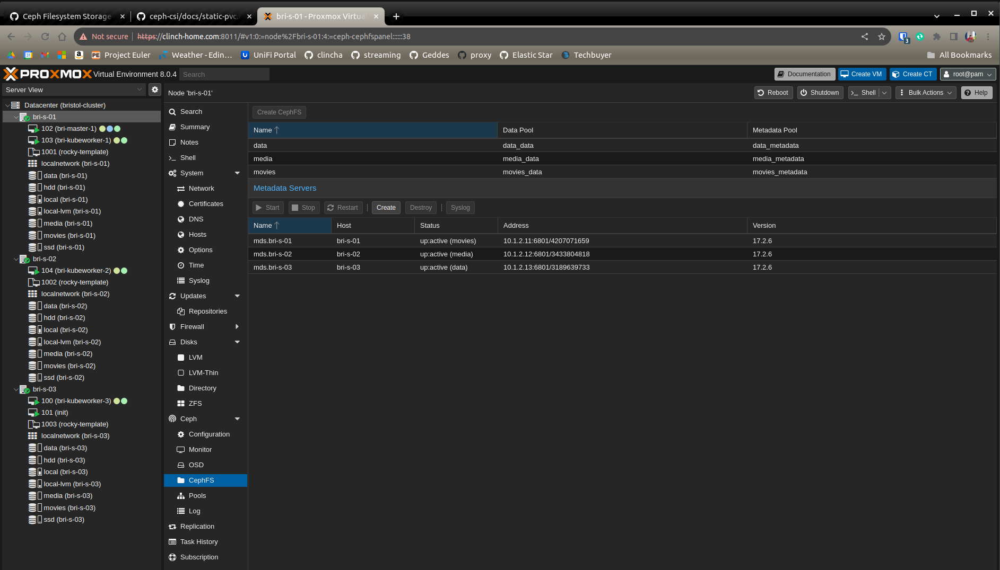

# Mount Ceph filesystem to Kubernetes

We need to create a CephFS to mount in Ceph. Use the Proxmox interface for this.



Once that's done login to the host as root

Get the filesystems on the host. E.G "data"
```bash
ceph fs ls
```

Get the subvolumegroup within the filesystem. E.G "downloads"
```bash
ceph fs subvolumegroup ls data
```

These can be created using the instructions of [the documentation](https://github.com/ceph/ceph-csi/blob/devel/docs/static-pvc.md#cephfs-static-pvc).

```bash
ceph fs subvolume ls data downloads
```

To create instead:
```bash
ceph fs subvolume create data complete downloads --size=1073741824
```

Then I need to create a config file for each of the mounts that creates a persistent volume and claim.

```yaml
---
apiVersion: v1
kind: PersistentVolume
metadata:
  name: data-media
spec:
  accessModes:
    - ReadWriteMany
  capacity:
    storage: 10T
  csi:
    driver: cephfs.csi.ceph.com
    nodeStageSecretRef:
      name: csi-rbd-secret
      namespace: ceph-csi-rbd
    volumeAttributes:
      "clusterID": "7c245ed6-0cd9-440e-887b-d9fd402c8470"
      "fsName": "data"
      "staticVolume": "true"
      "rootPath": /volumes/_nogroup/media/
    volumeHandle: data-media
  persistentVolumeReclaimPolicy: Retain
  volumeMode: Filesystem
---
apiVersion: v1
kind: PersistentVolumeClaim
metadata:
  name: data-media-pvc
spec:
  accessModes:
    - ReadWriteMany
  volumeMode: Filesystem
  resources:
    requests:
      storage: 10T
  storageClassName: ""
  volumeName: data-media
```