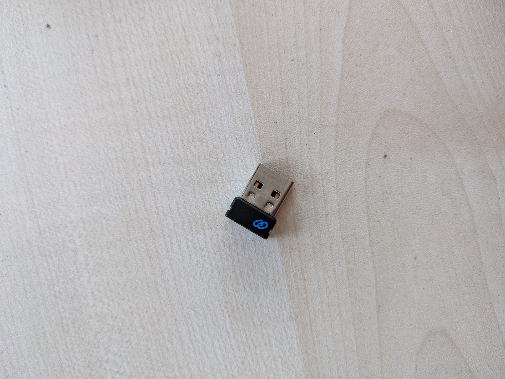

## Physical access

The servers do not have on board graphics and require an external GPU. Therefore, getting access to a shell on the
physical server can be tricky. This document outlines the process needed to get a shell.

### Pre-access

The server should be powered down, power supply unplugged and turned off and the lid of the case removed.

### Installing the GPU

Using a screwdriver, remove the covers for the PCI lanes.

Pop in the GPU and attach the two power supply cables needed for the GPU at the rear of the card.

Plug in HDMI or DVI to the display. One last step is to plug in a keyboard. I used a wireless Dell one which has drivers
already installed and worked in the BIOS.

Debug away :)