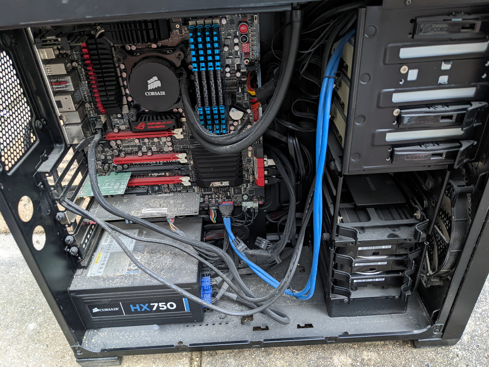
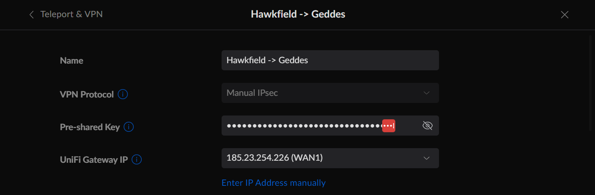

# Server Refresh 2022

I want a

- Quiet
- Globally distributed
- Connected (VPN)
- Monitored

network of computers.

## Objectives

The objective of this refresh is to create a globally resilient network of servers to act as a platform for
containerized applications.

Goals

- Physical server infrastructure globally distributed
- Kubernetes clusters that can run workloads despite site failures
- Secure storage option with 3 separate copies of data
- Project to demonstrate my abilities
    - Infrastructure
    - Application development
    - Cloud based technologies

Requirements

- Servers must be quiet enough to operate relativity close to sleeping people

### Quiet

The servers in Bristol have been keeping mum awake when she gets up. We can either improve the server closet or quieten
the servers.

#### Server cabinet noise dampening

- Rubber mat install
- Fill holes in wall
- Keep external fan on to reduce heat

#### New hardware

New consumer level hardware with enthusiast fans should be quieter and run cooler.

### Monitored

- Power consumption
- Active/Dead
- Temp
- Cameras

## Process

### Order

The storage class of servers will have the following configuration.

| Component                           | Price  | Quantity | Type        |
|-------------------------------------|--------|----------|-------------|
| ASUS PRIME B450M-A II               | Bundle | -        | Motherboard |
| Corsair Vengeance LPX Black         | Bundle | -        | RAM         |
| AMD Wraith Stealth CPU cooler       | Bundle | -        | CPU cooler  |
| AMD Ryzen™ 5                        | Bundle | -        | CPU         |
| Bundle                              | 359.99 | 1        | Bundle      |
| 128GB Gigabyte, M.2 NVMe SSD        | 21.98  | 1        | SSD         |
| 120GB Gigabyte SSD                  | 19.49  | 2        | SSD         |
| Seagate BarraCuda 4TB 3.5" SATA HDD | 73.79  | 3        | HDD         | 
| SATA III Cable, Male to Male        | 0.98   | 5        | Cable       |
| Lycom PE-120 PCIe HBA               | 51.98  | 1        | PCIe HBA    |
| 450W Cooler Master 450 Bronze PSU   | 29.99  | 1        | PSU         |
| 120mm Noctua NF-S12B-REDUX-1200     | 13.99  | 2        | Case fan    |
| 80mm Noctua NF-A8                   | 15.98  | 2        | Case fan    | 
| 4U Standard Chassis                 | 85.74  | 1        | Case        | 

For this refresh, one server will be built with all these components. Two additional servers will be built but without
the hard drives. These will be salvaged from the servers that these replace. The total costs are outlined below.

| Server   | Cost    |
|----------|---------|
| EDI-S-01 | 817.9   |
| BRI-S-01 | 618.29  |
| BRI-S-02 | 618.29  |
| Total    | 2054.48 |

The plan is to recoup some of these costs by selling the existing servers. However, these servers are now old, and I do
not expect to get much back from them.

### Build

The build happened in two stages. One server was built in Edinburgh to ensure that the parts worked well together, that
the machine could POST and that an SSH connection could be established. The second stage was the two new Bristol servers
which would take place when I traveled back to Bristol.

#### Edinburgh stage

I ordered all the parts needed for EDI-S-01, and they arrived the next day.


It was exciting building a computer again for the first time since I built my PC for home back in 2016. The two servers
that I had before had come built already and just needed hard drives installed. The CPU and motherboard were already
mated so there was nothing to do there. However, as I built the machine I found that there were only 2 fan headers on
the motherboard. Luckily the fancy Noctua fans that I purchased came with a few adaptors. One of them was a splitter
which let me utilise all 4 fans. The other was a low noise adaptor which I installed as well to try to meet the goal of
a quiet server room.


Once the server was built I had less than 12 hours to get it in a working state before I needed to be on a plane heading
down to Bristol.


Getting the server started was fairly trivial. It POSTed with no issues but I never got anything on the display. After
reading the SCAN website (where I purchased the motherboard/CPU bundle) I noticed that the bundle needed an external GPU
for the display to work, so I plugged in an old one I had lying around and got display.


I was pleased to see that the 450 watt power supply could handle the load of 3 HDDs, 2 SSDs, and a GPU during boot, but
I never had any issues related to power.

The last thing to do was install an OS. I made the decision to switch from Ubuntu, which I had been using for years, to
RHEL. At work I was starting to get used to using a Debian system and wanted a bit of a switch. I considered a shared
environment with both Ubuntu and RHEL but decided that making playbooks for both OSs wasn't something I fancied spending
time on. I signed up for a developer licence with RedHat and downloaded the ISO. RHEL8 was quickly installed and a root
user created.

I moved the server to its final location in my flat and was happy to hear... almost nothing! The quiet fans and consumer
hardware were doing their job.


I tried to be clever at this stage and use Ansible to configure the OS but hit issues with playbooks not being
compatible with RHEL. Once I finally managed to make it work it ran the SSH playbook, changed the ssh_config file and
locked me out! This meant, getting the server back down from its final location, installing the graphics card again,
logging in as root and setting the ssh_config back to default. I then uninstalled the GPU, put it back in its cupboard
and booted. I managed a quick test that night and then packed the bits I needed before getting to bed.
Bristol awaited.

##### Trouble

One of the drives is not registering on the OS. Will need to investigate and remove.

[This issue](https://github.com/clincha/clinch-home/issues/6) was raised and dealt with

#### Bristol stage

##### Out with the old

I removed the old servers from the server room, and hit them with compressed air to get all the dust out.


Some of them were pretty dusty...



Then I went into the server room, gave it a good clean and tidied all the computer bits up. I disconnected the internet briefly when I tidied up the cables but nobody noticed.


I'm going to try and sell these old machines. I don't expect to get much for them but at least they'll be gone.

##### In with the new

Arriving in Bristol I waited. The server components were delayed, I was having a pleasant holiday. Once the parts finally arrived I got to work. I put both servers together without much issue. I hadn't built a computer in ages, so it was nice to get back to how it all began. Although this time there were more disks.


I put down two sheets of rubber matting to help with vibrations and wheeled the server rack in. The servers went in nicely and I even found an old monitor and keyboard to use as a KVM. I needed to disable 'wait for F1 if no keyboard detected' in the BIOS but after that they were good to go. I was rushed to complete on time, so I only had enough time to make sure they showed up on the network. However, I think in the end I did a good job.


### Configure Ansible

Check that the hosts can reach one another over the internet.

- Create the ansible user
- Create the authorised_keys file with permissions

#### Troubleshooting

I changed the sshd file to have the line

    AllowUsers ansible

Which locked me out when the ssh key didn't work. Needed to get dad to login and do this:

- Login as root
- vi etc/ssh/sshd_config
- add root to the AllowUsers array


    ssh-agent bash
    ssh-add ~/.ssh/id_rsa

- [need to add the user to the sudoers role](https://developers.redhat.com/blog/2018/08/15/how-to-enable-sudo-on-rhel)

#### Network

This was quite painful to set up, but I think only because I wasn't being very clever with the way that I was working on things. I needed to be careful with the IP addresses. In the end I had a static public IP address configured at both locations and removed the issue of double NAT. I mostly used the Ubiquity GUI to set everything up.




I needed to log in to the CLI at some stage just to see what I was doing wrong. The commands to inspect things on the routers were centred around an application called ipsec. It was really important to look into the logs at BOTH sides. The issue only became clear once I was looking at the second node.

```text
# ipsec status
Security Associations (1 up, 0 connecting):
a4f5_632b_30fd_9dda[19]: ESTABLISHED 7 hours ago, 185.23.254.226[185.23.254.226]...137.220.119.74[137.220.119.74]
a4f5_632b_30fd_9dda{90}:  REKEYED, TUNNEL, reqid 2, expires in 11 minutes
a4f5_632b_30fd_9dda{90}:   0.0.0.0/0 === 0.0.0.0/0
a4f5_632b_30fd_9dda{91}:  INSTALLED, TUNNEL, reqid 2, ESP SPIs: c851547e_i c1425eb3_o
a4f5_632b_30fd_9dda{91}:   0.0.0.0/0 === 0.0.0.0/0
```

#### Disks

https://www.digitalocean.com/community/tutorials/how-to-partition-and-format-storage-devices-in-linux
https://www.digitalocean.com/community/tutorials/how-to-create-raid-arrays-with-mdadm-on-ubuntu-16-04