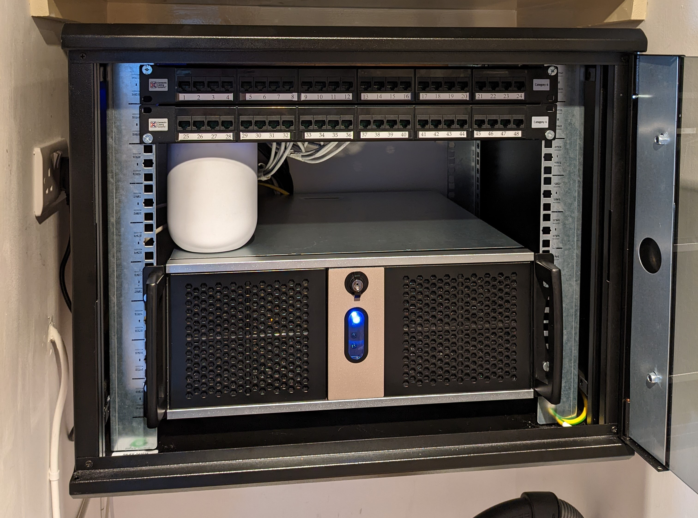
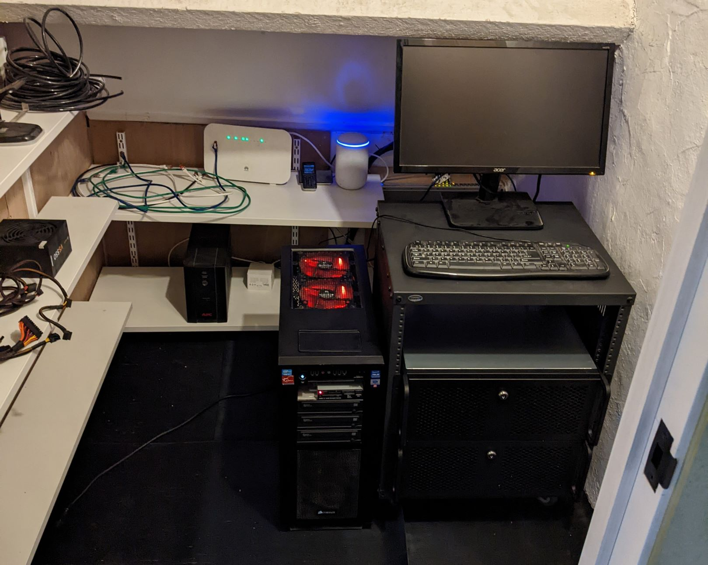
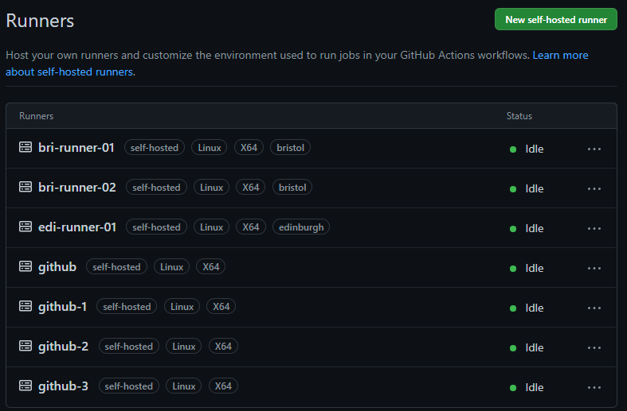

# clincha

## Overview

This is my personal cloud! Okay, maybe it isn't quite a _cloud_, but it's certainly more than a "home lab". I have physical servers in Edinburgh and Bristol. They run Proxmox, my hypervisor. I've connected the two sites with a site-to-site VPN connection and I use that as my lab. It's already helped me reinforce my learning of the "infrastructure" component of the stack and will soon be my playground to push my understanding of the "development" component of the stack. I want to be the ultimate full stack developer, not just understanding the code that runs but the complete environment it runs in, right down to the electrons leaving the plug.

## From bottom to top

### Physical servers

#### Edinburgh
I own a flat in Edinburgh that I currently let out on AirBnb. My friend, Roger, and I installed a small 9u rack in a cupboard and put in a custom-made server. You can read more about that process [here](https://github.com/clincha/clinch-home/blob/master/Documentation/server-refresh/refresh.md#edinburgh-stage).

#### Bristol
My parents have a house in the countryside in Bristol. My parents were renovating the place a couple of years ago, including the loft. I asked if they'd be willing to have some of my servers at their home. They agreed with the condition that it was quiet and that I ensured they had no more internet connection issues in their house (we'd had rubbish internet for years at this point). I agreed and got on the phone to Truespeed, a fibre to the home internet service provider based in the South West of the UK. They organised the installation of a cable, and we signed up for the business package so I could get rid of their cheap router/access point combo. I hooked up my router, and ta-da! my parents had the internet connection they wanted and when the construction completed, I had small cupboard in the loft for my kit. 

During their renovation, I encouraged them to run CAT6 around the house to specific locations. At these locations I installed Ubiquity access points which routed back to the closet in the roof. With my side of the bargain complete, I moved in two old Dell servers I had got cheap in Indonesia, filled them with hard drives and spun them up. Little did I know, that by turning the beasts on I had broken my side of the bargain again... They were **LOUD**. Given that the cupboard was right above where they sleep they were not impressed. Shortly after turning them on they were back collecting dust. 

It was time to refresh the hardware I was using in my lab. I kicked off my server refresh project with a new set of [requirements for my lab](https://github.com/clincha/clinch-home/blob/master/Documentation/server-refresh/refresh.md#objectives). I wanted a quiet, globally distributed, connected and monitored network of computers. While I haven't reached those objectives, I'm well on my way with two sites in the UK. The servers I built were quiet and [don't keep my mum up at night](https://github.com/clincha/clinch-home/issues/4) which is a big win. 

This is what Bristol looks like now:

### Proxmox
Once I had the physical servers in place I loaded up RHEL9 on each machine and installed Kubernetes. What a mess that was. I couldn't think of a good reason to install a hypervisor when I started out. I thought that it would just eat up resources that could otherwise be used for actually useful services. How wrong I was... When I made mistakes they hung around like a released felon. I couldn't _prove_ that the issues I was having were caused by that change I had made a couple of minutes ago, but I was still sure of it. The machines started to feel dirty. I blamed every change that I did like it caused a plethora of issues later down the track. It wasn't a nice environment to work on.

The solution was to create a development server that I could test stuff out on and then push those changes out into production. The first idea I had was to make changes to Edinburgh and then when I was happy, push them out to Bristol. That worked better, but it was costly to image the Edinburgh server every time I needed a clean slate. I decided to bite the bullet in the end and image all the servers with Proxmox. Life became so much simpler. When I got myself in a mess I'd simply create a new VM and start again not making that mistake anymore. The burden of getting something wrong didn't feel so great anymore. I could experiment wildly, knowing it was simple to get things back on track.

The feeling of wild experimentation slowly wore down as the process of booting up new VMs and configuring each every time became tiring. I was in a much better position than before, but the twenty minutes it now took to get a new machine was feeling a lot like the two hours had before. I needed to cut that down.

### Packer
Packer gave me the opportunity to build out templates that I could clone from quickly. A process that took me 20 minutes of manual work was now a few simple clicks. It was the first infrastructure as code tool that I picked up during this process, and I was impressed with how well it coped with the boot process. It communicated well with Proxmox but had some small teething issues. 

Packer needs to be run on a machine in the same network as the hypervisor. I was using GitHub workflows to build my servers, so it meant that I needed to have a [runner already installed internally](https://github.com/clincha/clinch-home/blob/master/Documentation/deployment.md#configuring-virtual-github-runner). That was no problem but something I'd ideally like to do [outside the network at some point](https://github.com/clincha/clinch-home/issues/11). The time Packer saved me was great and caused me to divert from my initial goal of getting a Kubernetes cluster up and running ASAP to spending more time with infrastructure as code tooling.

### Terraform
After the success of Packer I decided to dive into the world of Terraform. Little did I know, this adventure would slash my build times from minutes to seconds. Machines are the ultimate machine builder it seems. The cloning, setting of hostnames, ip configuration and the strange inconsistencies was all done away with when the machine took over. Flawlessly creating my environment and healing it when my reckless mouse clicks polluted its creations. I could have a new development machine at my disposal in seconds with the right configuration ready to go. I still had to do the work on them once they were created though.

### Ansible
I was beginning to reach dizzying heights in the stack. I had VMs ready to do my bidding at the drop of a hat and the ability to blow away any that misbehaved. My environment was well-defined but useless. With nothing running on the servers themselves it was time for them to spur into action. I have been using Ansible at work a lot, and it was natural for me to use it here as well. Once the user accounts and SSH rules were taken care of I installed the applications I'd be using in my environment.

The first tool I wanted on there were GitHub runners. I had manually created them before I had Packer working, and they were showing their age. I had used the server they ran on as a test server a few times and some strange inconsistencies with Python had lost me hours one evening. I found a really useful Ansible role to install the runners and configured it with my parameters, and before I knew it they were running and ready.

Next on the list was Kubernetes. It would be the final part of the infrastructure stack to install and mark the end of the main features needed for this repository. Eventually, all applications that I create should sit in these clusters. Writing about it now I feel a little pang of sadness, which is weird to feel for a bunch of code and some metal. It's been a process though, and one that not many undertake. There are so many downsides: the cost, the time commitment, the environmental impact and the inflexibility of the solution to name a few. However, it's been a journey of learning, excitement, frustration and growth. I've had bonding moments installing a rack with Roger, tough times negotiating with my parents on noise levels and times to nerd out with my girlfriend (who listens so diligently to my ramblings). It might not be the best way to get a Kubernetes cluster up and running, but each moment could carry all the pain alone.

To conclude this part of the adventure, I created an Ansible role for the cluster. I couldn't have dreamed of creating this role when I started out. I had actually tried before and failed after installing the completely wrong dependencies for my operating system. This time though, it was simple. I knew what I needed to do through research and I knew where to go for help. I even managed to contribute to another repository when I found a minor bug. I edited down the code I had written to install Kubernetes right at the start and added a few lines of configuration. Ansible ran, Kubernetes installed, and the cluster was ready.
