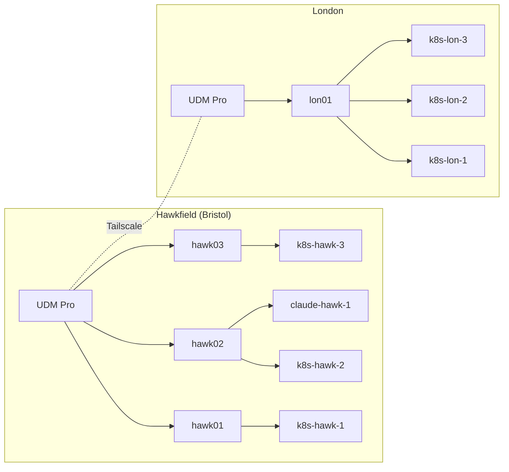

# clincha

This is my personal cloud. Two sites — Hawkfield (Bristol) and London — running physical servers that I built myself. The full stack goes Proxmox → Packer → Terraform → Ansible → Kubernetes → Flux CD. It's more than a home lab but probably less than a cloud. I want to be the ultimate full stack developer, not just understanding the code that runs but the complete environment it runs in, right down to the electrons leaving the plug.

  
  
  
  
  
  
  
  

## Infrastructure

```mermaid
graph LR
    subgraph "Hawkfield (Bristol)"
        direction TB
        udm_h[UDM Pro] --> hawk01[hawk01]
        udm_h --> hawk02[hawk02]
        udm_h --> hawk03[hawk03]
        hawk01 --> kh1[k8s-hawk-1]
        hawk02 --> kh2[k8s-hawk-2]
        hawk03 --> kh3[k8s-hawk-3]
        hawk02 --> claude[claude-hawk-1]
    end

    udm_h -. Tailscale .- udm_l

    subgraph "London"
        direction TB
        udm_l[UDM Pro] --> lon01[lon01]
        lon01 --> kl1[k8s-lon-1]
        lon01 --> kl2[k8s-lon-2]
        lon01 --> kl3[k8s-lon-3]
    end
```

Everything is deployed as code: Packer builds VM templates, Terraform provisions them, Ansible configures them, and Flux CD continuously reconciles Kubernetes workloads from this repo.

### Site Details

| | Hawkfield (Bristol) | London |
|---|---|---|
| **Proxmox hosts** | hawk01, hawk02, hawk03 | lon01 |
| **K8s nodes** | 3x 10-core, 64GB (10.1.2.101–103) | 3x 4-core, 4GB (10.2.0.101–103) |
| **Ingress** | nginx-ingress | Traefik |
| **Infrastructure** | MetalLB, Longhorn, Cert-Manager | MetalLB, Longhorn, Cert-Manager |
| **Monitoring** | Prometheus, Grafana, Uptime Kuma | — |
| **Applications** | Homepage, Factorio, Satisfactory | Homepage |
| **Other VMs** | claude-hawk-1 (Claude Code) | — |

Per-machine hardware spec sheets — board, CPU, memory, drives, free slots and upgrade paths — are in [Documentation/hardware](Documentation/hardware/README.md).

What the NAS backs up, what it deliberately does not, and why — [Documentation/hawkstore/backup-policy.md](Documentation/hawkstore/backup-policy.md).

What each app on the NAS is for, and what has been removed — [Documentation/hawkstore/apps.md](Documentation/hawkstore/apps.md).

How the NAS web UI gets a real Let's Encrypt certificate, and how to rotate its Cloudflare token — [Documentation/hawkstore/tls-certificate.md](Documentation/hawkstore/tls-certificate.md).

## Workflow Status

### Infrastructure

### Maintenance

### CI/CD

## The Journey

From rack-mounting servers with a friend in London, to negotiating noise levels with my parents in Bristol, to finally getting Kubernetes clusters humming across both sites — the path here has been anything but straight. Read the full story in [Documentation/journey.md](Documentation/journey.md).
