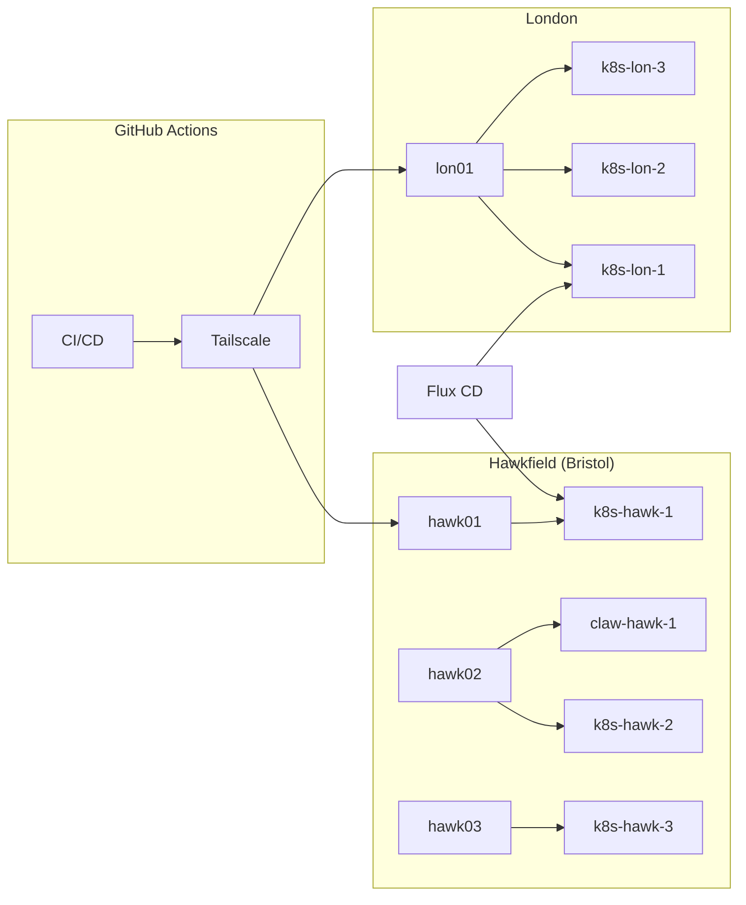

# clincha

This is my personal cloud. Two sites — Hawkfield (Bristol) and London — running physical servers that I built myself. The full stack goes Proxmox → Packer → Terraform → Ansible → Kubernetes → Flux CD. It's more than a home lab but probably less than a cloud. I want to be the ultimate full stack developer, not just understanding the code that runs but the complete environment it runs in, right down to the electrons leaving the plug.

## Infrastructure

```mermaid
graph LR
    subgraph "GitHub Actions"
        gha[CI/CD] --> ts[Tailscale]
    end

    subgraph "Hawkfield (Bristol)"
        hawk01[hawk01] --> kh1[k8s-hawk-1]
        hawk02[hawk02] --> kh2[k8s-hawk-2]
        hawk03[hawk03] --> kh3[k8s-hawk-3]
        hawk02 --> claw[claw-hawk-1]
    end

    subgraph "London"
        lon01[lon01] --> kl1[k8s-lon-1]
        lon01 --> kl2[k8s-lon-2]
        lon01 --> kl3[k8s-lon-3]
    end

    ts --> hawk01
    ts --> lon01

    flux[Flux CD] --> kh1
    flux --> kl1
```

### Site Details

| | Hawkfield (Bristol) | London |
|---|---|---|
| **Proxmox hosts** | hawk01, hawk02, hawk03 | lon01 |
| **K8s nodes** | 3x 10-core, 64GB (10.1.2.101–103) | 3x 4-core, 4GB (10.2.0.101–103) |
| **Ingress** | nginx-ingress | Traefik |
| **Infrastructure** | MetalLB, Longhorn, Cert-Manager | MetalLB, Longhorn, Cert-Manager |
| **Monitoring** | Prometheus, Grafana, Uptime Kuma | Elastic Operator |
| **Applications** | Homepage, Factorio, Satisfactory | Homepage, Elastic Finance |
| **Other VMs** | claw-hawk-1 (OpenClaw) | — |

## Workflow Status

### Infrastructure

### Maintenance

### CI/CD

## The Journey

From rack-mounting servers with a friend in London, to negotiating noise levels with my parents in Bristol, to finally getting Kubernetes clusters humming across both sites — the path here has been anything but straight. Read the full story in [Documentation/journey.md](Documentation/journey.md).
